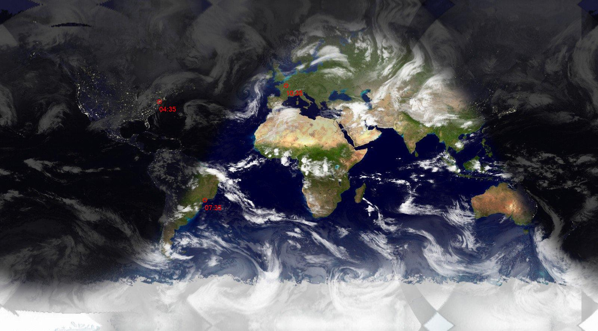
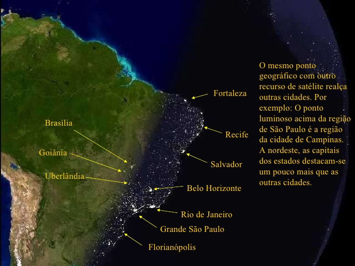
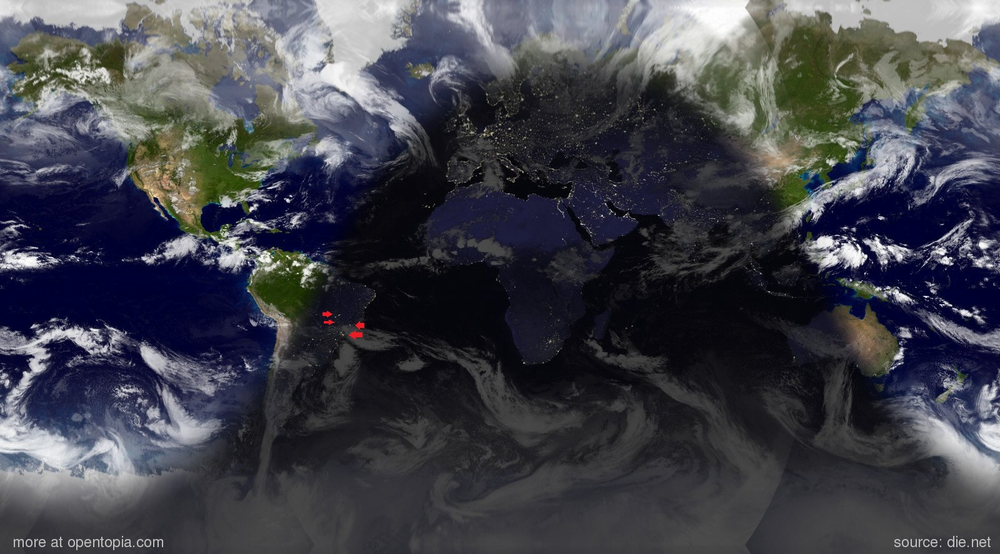
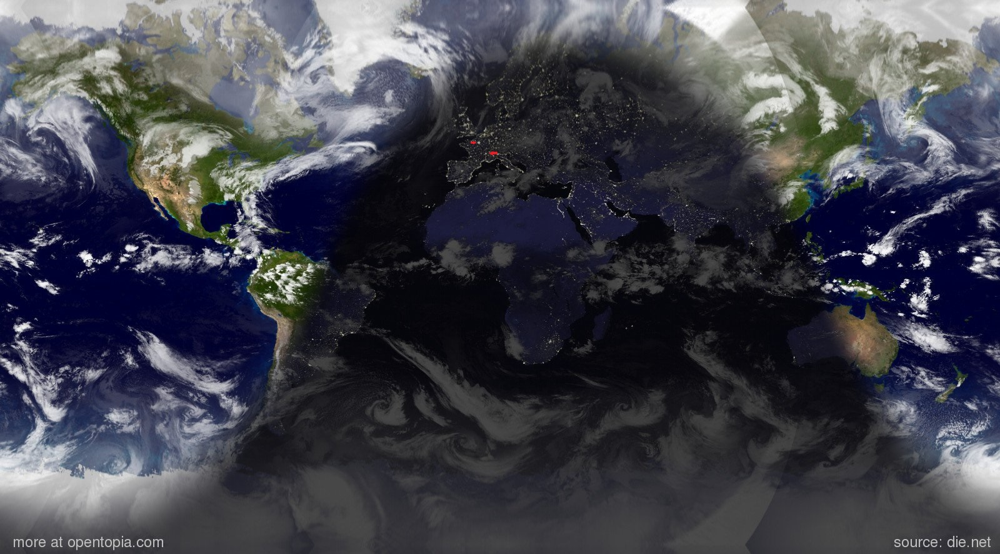
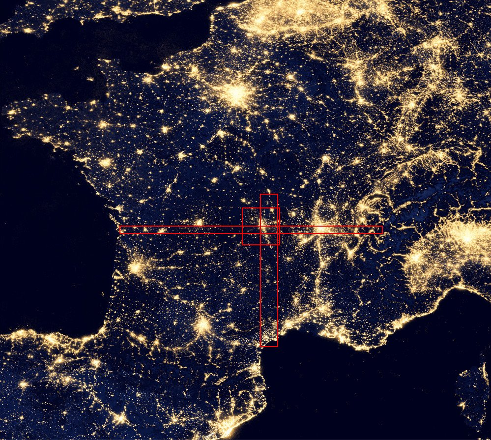

# sunlight_wallpaper_changer
lorem ipsum dolor sit amet

## How to
1. mudar o nome dentro dos arquivos pro seu nome de usuario
    * Dar um ctrl+h em `/home/italo/`
    * Substituir todos pela sua home
    * Se o seu computador estiver em uma lingua diferente da que esta o meu, troque o nome da pasta Images/Wallpapers pelo equivalente.
    
2. colocar o changer.sh, pin_locator.py e a pasta pinlocator_files o na sua pasta ~/Images/Wallpapers/

3. colocar o arquivo autostarter.desktop na sua pasta ~/.config/autostart/

4. rode o script changer.sh para testar

5. fiz isso correndo e so pra mudar meu papel de parede de forma rapida, então qualquer erro (vao ter mtos), me avise.

## Exemplo

## Imagens que usei de referencia

## Licença
Se esse código for útil para você em algum dia me pague um café.

## Autor
* Ítalo Fernandes - [italogsfernandes.github.io](https://italogsfernandes.github.io)
